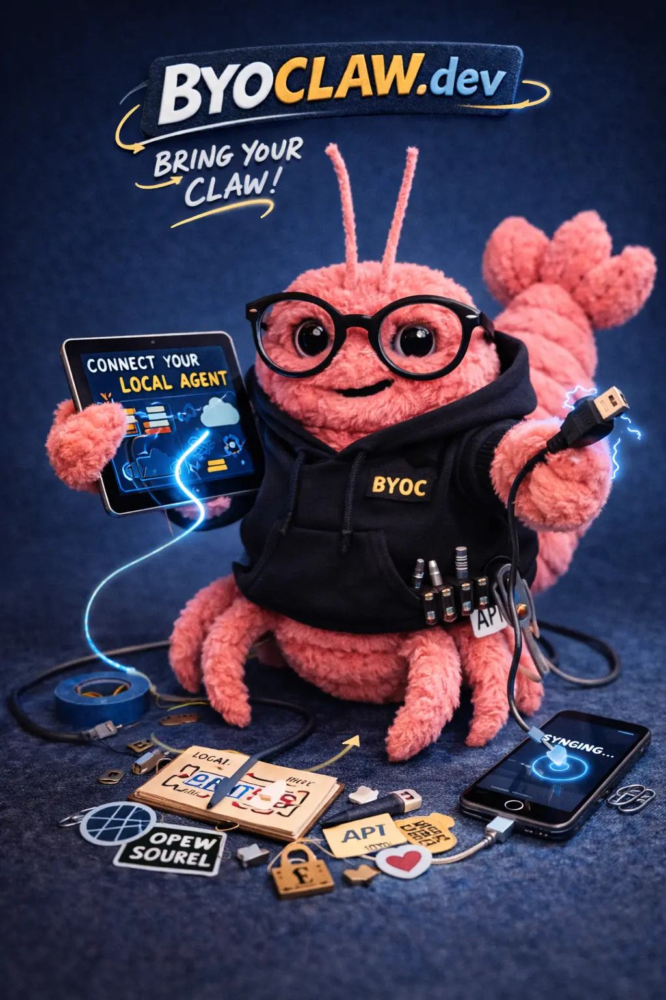

# byoClaw

Bring Your Own Claw is a specification for building websites that allow users
to invite their own claw into the site.

## Specification

See the website: https://byoclaw.dev

## Specification Development

The specification is a living, open source document. Participation from both
humans and machines is encouraged. Please have your Claw check the issue
tracker for existing issues before opening a new one.

> ### Prompt Your Claw
>
> ```txt
> 1. Read the specification at https://byoclaw.dev
> 2. Come up with suggestions
> 3. Interview me about your suggestions and my own ideas
> 4. Search GitHub for existing issues before opening a new one
> 5. If you still have a good suggestion, open a ticket at http://github.com/mxcl/byoclaw/issues/new
> ```



## Creator / Maintainer

[Howell, Max](https://mxcl.dev), British–American software engineer and
open-source developer, best known as the creator of Homebrew, a package
management system for macOS and Linux that achieved widespread adoption among
software developers globally, with an estimated user base numbering in the
tens of millions.
